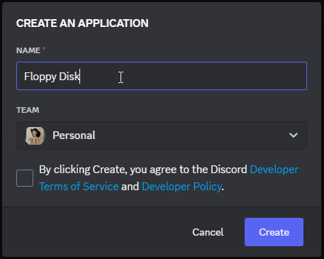
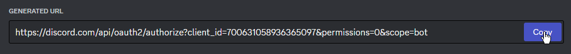

# Creating your bot
To use the bot, you will need to create an application through Discord's developer portal and invite it to your server.

[Discord's Developer Portal](https://discord.com/developers){ .md-button .md-button--primary }

## Creating an application
Go to the developer portal and create a new application. If you already have an application available, you can skip this step.

Give the app a name, click on the checkmark, and click create.

After creating your application, navigate to the Bot section of your application, and click **Reset Token**.

!!! warning

    Make sure you save your token somewhere in case you need to reference it again in the future. If you lose your token, you will be required to regenerate a new one.

!!! danger "Never share your token!"

    Your bot's token is like a password. Never share your token with anyone or anywhere!

Go to the OAuth section of your application and generate your bot's invite link, and then to the URL Generator to create your bot's invite link.

When generating the invite link, make sure you select the `bot` scope.

Finally, copy the link and open the link into a new tab to invite the bot to your server.

!!! note

    To invite an application, you need the **Manage Server** permission in the server you're adding it to.

!!! tip "Message Content Privileged Intent"

    ChadMusic can function without the Message Content intent. If you want to utilize the classic prefix commands, make sure you tick the Message Content Intent switch under the **Bot** section of your application to the ON position.

    

    Understand that ChadMusic wasn't really designed for huge public bots in mind, but nothing is stopping you from using it on large public bots. Once your application reaches 100 servers, you won't be able to use this intent and your request for the message intent will most likely be denied.
